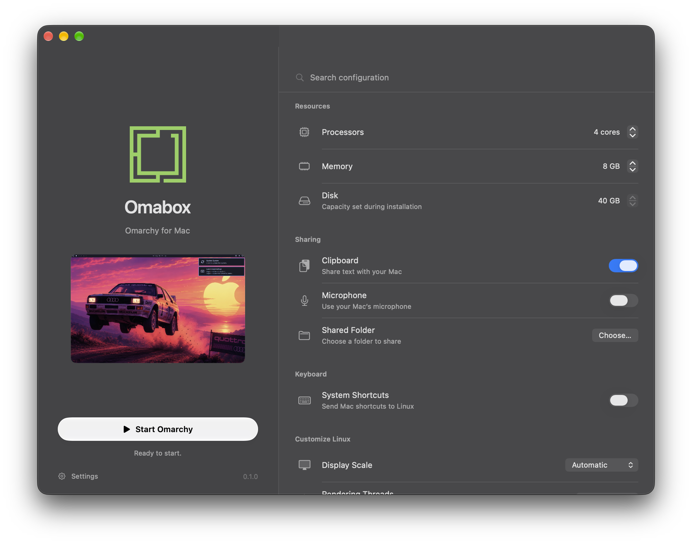
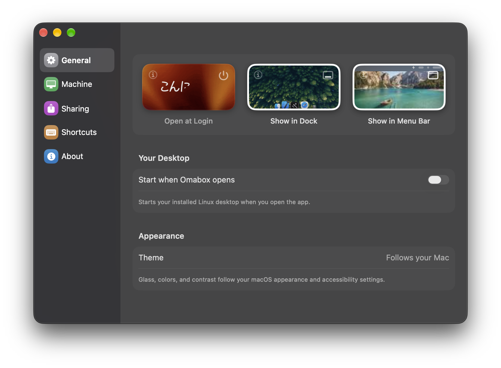

  

<h1 align="center">Omabox</h1>

Run Omarchy on your Mac.

  

  

  

Requires **macOS 26 or later** and **Apple silicon**.

Built with App Sandbox and Hardened Runtime.

[Build from source](Docs/Build.md) · [MIT license](LICENSE) · [Third-party notices](THIRD_PARTY_NOTICES.md)
