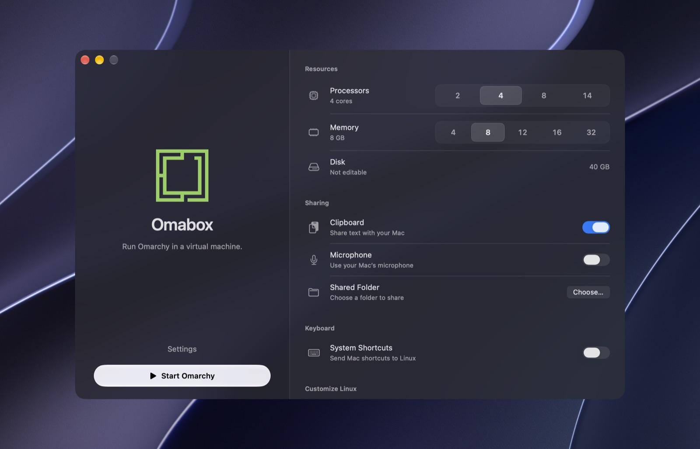
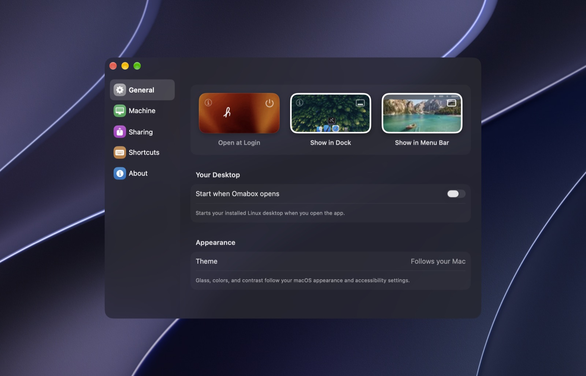

> [!WARNING]
> APPLE REMOVED MY APPLE ID FOR MAKING MAC APPS that they didn't agree with. Please wait a moment while I figure out new signing keys. Until then, macOS reports the downloaded app as damaged. Move the app to Applications, then run:
>
> ```bash
> xattr -c /Applications/Omabox.app
> open /Applications/Omabox.app
> ```

<p align="center">
  
</p>

<h1 align="center">Omabox</h1>

<p align="center">Run Omarchy on your Mac.</p>

<p align="center">
  <a href="https://github.com/Aayush9029/Omabox/releases/latest">
    
  </a>
</p>

<p align="center">
  
</p>

<p align="center">
  
</p>

Requires **macOS 26 or later** and **Apple silicon**.

Built with App Sandbox and Hardened Runtime.

[Build from source](Docs/Build.md) · [MIT license](LICENSE) · [Third-party notices](THIRD_PARTY_NOTICES.md)
